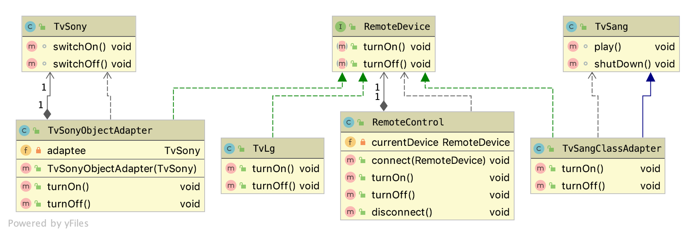

# The Adapter Design Pattern

The Adapter Design Pattern is designed to make two incompatible types compatible 
without changing their existing code.
{: .fs-6 .fw-300 }

---

The Adapter Design Pattern is also known as "Wrapper". It simply wraps things.

## What problems does it solve?
To make two incompatible types compatible by converting one interface into another. The intention 
here is not to add/ remove/ modify behavior, but to adapt the existing one.

There are two types of adapters (two approaches):
- Class Adapter - uses inheritance and extends the source object
- Object Adapter - uses composition ("has a" relation) and holds the source object as a property of the adapter class

**Via adapters we don't add functionality, only make things compatible!**

Glossary:
- Client - the one, who uses the target interface
- Target - the new interface = target interface = the interface, which client uses
- Adaptee - the incompatible interface (legacy/ old), that needs to be adapted = source interface
- Adapter - adapts the adaptee to the target, so that client can use the adaptee as well

## Pros:
- easy to extend without changing the old functionality
- the conversation between both is separated from the business logic 

## Cons:
- complexity of the code increases

## How to recognize it?
* When a creational method accepts as argument an interface/ abstract type and returns 
an implementation of own/another abstract/interface type which decorates/overrides the given instance

Class Adapter:
```java
public class TvSangClassAdapter extends TvSang implements RemoteDevice {

    @Override
    public void turnOn() {
        play();
    }

    @Override
    public void turnOff() {
        shutDown();
    }
}
```
Object Adapter:
```java
public class TvSonyObjectAdapter implements RemoteDevice {

    private TvSony adaptee;

    public TvSonyObjectAdapter(TvSony adaptee) {
        this.adaptee = adaptee;
    }

    @Override
    public void turnOn() {
        this.adaptee.switchOn();
    }

    @Override
    public void turnOff() {
        this.adaptee.switchOff();
    }
}
```
## Examples from Java API
```
java.util.Arrays#asList()
java.util.Collections#list()
java.util.Collections#enumeration()
java.io.InputStreamReader(InputStream) (returns a Reader)
java.io.OutputStreamWriter(OutputStream) (returns a Writer)
javax.xml.bind.annotation.adapters.XmlAdapter#marshal() and #unmarshal()
```
## Scenarios
* When you have two independent types and you want to make them work together 
  
* When you have to use some external API

* When you have to integrate with external system
  
### Example 1
Let's say, we have an universal remote control, that we use currently to turn on and turn off our LG TV.
We also have two more TVs - a Sang TV and a Sony TV, that also can be controlled remotely by their own remote controls.
We want to start using only one universal remote control instead three different remote controls. 
The problem is that the universal remote control (RemoteControl = Client) uses different interface (RemoteDevice = Target), 
which is currently incompatible with the Sang (Adaptee 1) and Sony TVs (Adaptee 2). 
What we need in this case is to create two adapters for the incompatible interfaces. 
To adapt the Sang TV (to be controlled by our universal remote control), we will use the ClassAdapter approach (TvSangClassAdapter). 
For the Sony TV, we will implement an ObjectAdapter (TvSonyObjectAdapter).
When we implement a ClassAdapter, our Adapter should inherit Sang TV in order to adapt it's the functionality to the new interface.
When we implement an ObjectAdapter, our Adapter should "have a" Sony TV as instance field in order to adapt it's the functionality to the new interface.

[Source Code](https://github.com/Iretha/ebook-design-patterns/tree/master/src/com/smdev/structural/adapter) 



Now, let's implement it:

1). Create RemoteDevice interface. This is the TARGET interface, that out Client uses. 
In the terms in Java, this is a generic interface to represent remote devices, which can be controlled remotely by our remote control.
```java
public interface RemoteDevice {

    void turnOn();

    void turnOff();
}
```
2). We need our RemoteControl as well. This is the CLIENT, who uses the TARGET interface (RemoteDevice).
The remote control (client) can connect to a remote device (target) and can turn the device on/off or disconnect from it.
```java
public class RemoteControl {

    private RemoteDevice currentDevice;

    public void connect(RemoteDevice device) {
        if (this.currentDevice == null) {
            this.currentDevice = device;

            System.out.println("Connected to " + this.currentDevice.getClass().getSimpleName());
        }else{
            System.out.println("Connected to another device. Please disconnect it first!");
        }
    }

    public void turnOn() {
        if (this.currentDevice != null) {
            this.currentDevice.turnOn();
        }
    }

    public void turnOff() {
        if (this.currentDevice != null) {
            this.currentDevice.turnOff();
        }
    }

    public void disconnect() {
        System.out.println("Disconnected from " + this.currentDevice.getClass().getSimpleName());

        this.currentDevice = null;
    }
}
```
3). Next Step is to create the device (TvLg), which is currently working with our remote control and doesn't need to be adapted.
We will use it for illustration purposes only.
```java
public class TvLg implements RemoteDevice {

    @Override
    public void turnOn() {
        System.out.println("TV LG is turned on!");
    }

    @Override
    public void turnOff() {
        System.out.println("TV LG is turned off!");
    }
}
```
4). We also have a Sang TV (adaptee), which we want to adapt, so that we can use it with the universal remote control.
```java
public class TvSang {

    void play(){
        System.out.println("TV Sang is playing!");
    }

    void shutDown(){
        System.out.println("TV Sang is shut down!");
    }
}
```
5). We need an adapter to control the Sang Tv with our remote control. 
This is a class adapter that uses inheritance to adapt to the target interface.
```java
public class TvSangClassAdapter extends TvSang implements RemoteDevice {

    @Override
    public void turnOn() {
        play();
    }

    @Override
    public void turnOff() {
        shutDown();
    }
}
```
6). We also have a Sony TV (adaptee), which we want to adapt, so that we can use it with the universal remote control.
```java
public class TvSony {

    void switchOn(){
        System.out.println("TV Sony is switched on!");
    }

    void switchOff(){
        System.out.println("TV Sony is switched off!");
    }
}
```
5). We need an adapter to control the Sony TV with our remote control. 
This is an object adapter, that uses composition ("has-a" relationship) to adapt to the target interface.
The adapter receives the device instance to adapt in it's constructor; 
```java
public class TvSonyObjectAdapter implements RemoteDevice {

    private TvSony adaptee;
    
    public TvSonyObjectAdapter(TvSony adaptee) {
        this.adaptee = adaptee;
    }

    @Override
    public void turnOn() {
        this.adaptee.switchOn();
    }

    @Override
    public void turnOff() {
        this.adaptee.switchOff();
    }
}
```
6). Here is an example with three different cases:
- No adapting needed
- Adapted via Class Adapter
- Adapted via Object Adapter

```java
public class _Main {
    public static void main(String[] args) {
        testRemoteControl(new TvLg());  // doesn't need to be adapted, because LG supports our remote control
        testRemoteControl(new TvSangClassAdapter()); // adapted to support our remote control using class adapter
        testRemoteControl(new TvSonyObjectAdapter(new TvSony())); // adapted to support our remote control using object adapter
    }

    private static void testRemoteControl(RemoteDevice device) {
        RemoteControl remoteControl = new RemoteControl();
        remoteControl.connect(device);
        remoteControl.turnOn();
        remoteControl.turnOff();
        remoteControl.disconnect();
        System.out.println("");
    }
}
```

Output:
```ssh
Connected to TvLg
TV LG is turned on!
TV LG is turned off!
Disconnected from TvLg

Connected to TvSangClassAdapter
TV Sang is playing!
TV Sang is shut down!
Disconnected from TvSangClassAdapter

Connected to TvSonyObjectAdapter
TV Sony is switched on!
TV Sony is switched off!
Disconnected from TvSonyObjectAdapter
```


